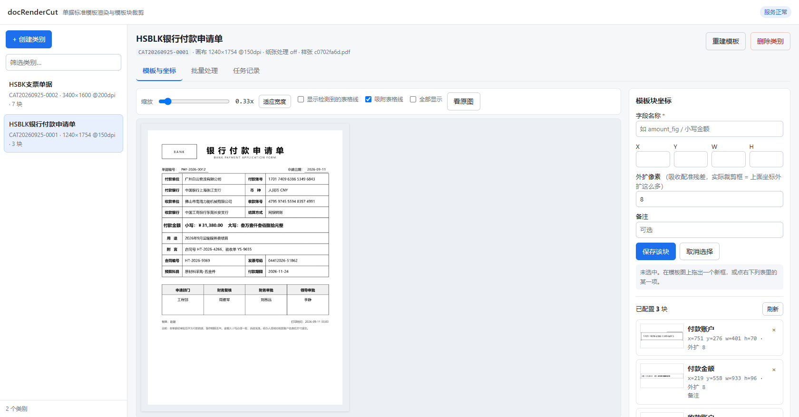
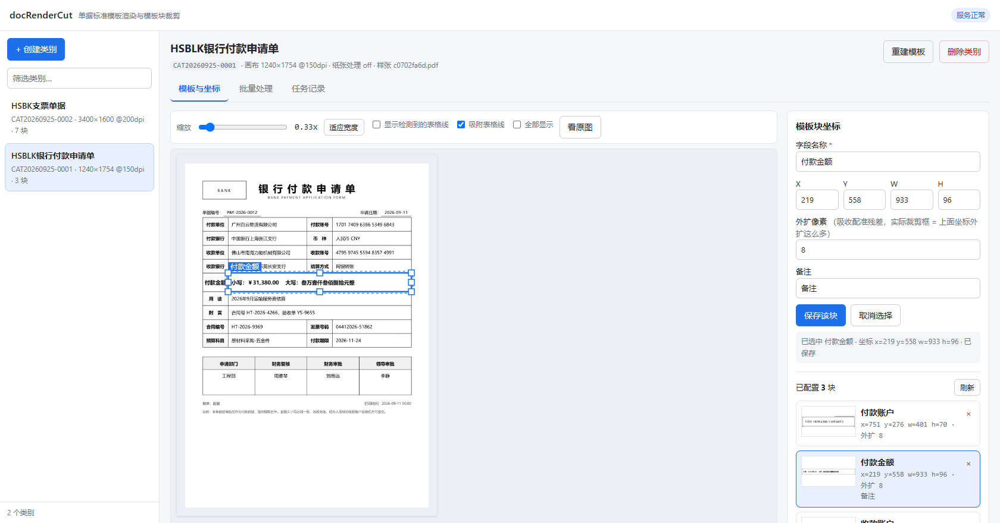
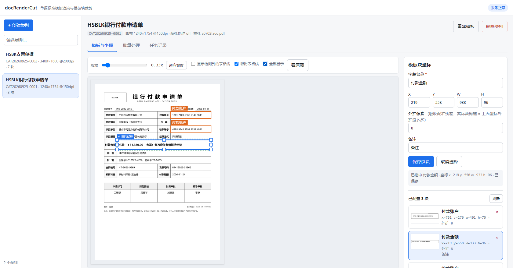
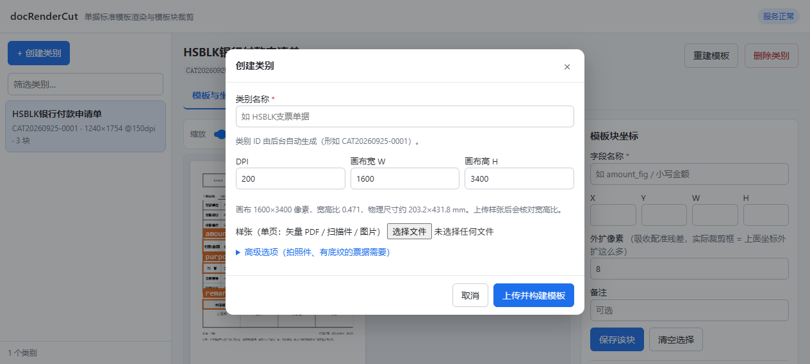
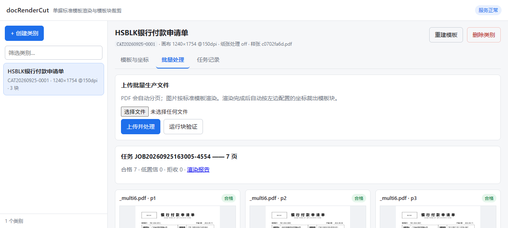
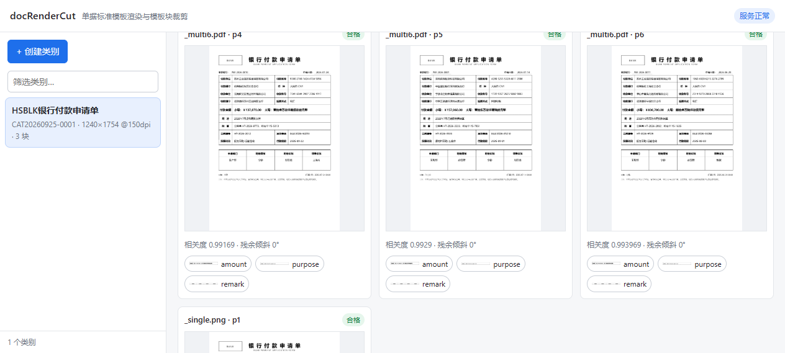

# docRenderCut

业务单据**标准模板渲染 + 模板块裁剪**的前后端项目。

解决的问题：业务方给的一批扫描件（PDF / 图片）规格不一，按固定坐标裁剪目标字段总会出现
"有的裁全、有的裁一半、有的完全裁不到"。本项目为每个单据类别建立一个**标准模板**，
所有输入都渲染进同一个坐标系，于是在模板上量一次坐标，之后任何输入都用同一组坐标裁剪。

已实测：同一类别的 30 页输入，用同一组固定坐标裁出的「付款金额」块，表格边框与栏目
逐像素重合，只有填写内容不同；块位移 P50 **0.23px**。

---

## 快速开始

依赖：Python 3.9+（无需系统级安装，全部依赖在 `requirements.txt`）。

```bash
# 1. 安装依赖（只需一次）
pip install -r requirements.txt

# 2. 启动
python app.py

# 浏览器打开 http://127.0.0.1:8848
```

Windows 也可以直接双击 `run.bat`；macOS / Linux 用 `bash run.sh`。
这两个脚本都会在缺依赖时自动执行 `pip install -r requirements.txt`。

接口文档（自动生成）：http://127.0.0.1:8848/docs

---

## 使用流程

### 1. 创建类别

点左上「+ 创建类别」，弹窗里填：

| 字段 | 说明 |
|---|---|
| 类别名称 | 如 `HSBLK支票单据` |
| 类别 ID | **后台自动生成**，形如 `CAT20260925-0001`（日期 + 当日序号，可读可排序） |
| DPI | 标准模板的目标 DPI，如 `200` |
| 画布 W / H | 标准模板的像素尺寸，如 `1600` / `3400` |
| 样张 | 单页：矢量 PDF / 扫描件 / 图片 |
| 高级选项 | 纸张处理（整页 / 自动四角 / 手工四角）、深墨偏置 |

提交后后端按参数重新渲染，产出该类别的标准模板图。**完成后可点「模板预览」查看**，
再关闭弹窗。若画布宽高比与样张相差超过 2%，弹窗会给出警告与建议尺寸
（不一致会让内容被非等比拉伸，表格线变粗变细）。

### 2. 配置模板块坐标

选中类别 → 「模板与坐标」页：

- 在模板图上**按住拖动框选**一块；勾选「吸附表格线」时框边会自动贴到检测到的表格线上。
- **默认不显示任何框**，点右下列表里的某一项才显示它的框（框多了会糊住底图，看不清版式）。
  需要总览时勾选工具栏「全部显示」。
- 选中的框可以直接**拖内部移动坐标**、**拖 8 个手柄改宽高**；
  右侧 X/Y/W/H 与框双向联动，也可以用方向键 ±1px 微调。
- 右侧填**字段名称**（就是裁剪产物的文件名）、外扩像素、备注，点「保存该块」。
- 已配置的块在右下列表里显示**从模板裁出来的预览缩略图**，一眼就能看出框得对不对。
  （后端接口 `/api/categories/{id}/crops/{块}/preview` 现场裁剪并返回图片。）

「外扩像素」是实际裁剪时在坐标基础上向外扩的量，用来吸收有界的配准残差——
**坐标量得准不准**和**留了多少余量**是两件事，分开配置。

### 3. 上传批量生产文件

「批量处理」页上传一批文件：

- **PDF 自动分页**（一份 6 页 PDF 产出 6 个页面单元）
- 图片按标准模板渲染
- 渲染完成后**自动按上一步的坐标清单裁出模板块**

每个页面卡片显示：状态、标准输出图缩略图、逐块裁剪结果。点缩略图或块标签可放大预览。

### 4. 验证

点「运行块验证」：把同一块从每一张输出里按**同一组固定坐标**裁出来纵向堆叠，
并逐块给出与模板同坐标区域的**亚像素位移**。堆叠图版式重合 = 坐标真的固定住了；
某行错位 = 那张输入没对齐。

---

## 类别作用域

**「批量处理」和「任务记录」两页都是严格属于某个类别的**——因为这两页本身就是
"往这个类别里写"和"这个类别历史发生了什么"，跨类别混在一起没有意义，还容易误判。

具体做法：

- 两页顶部都有**作用域提示**（`上传目标类别：…` / `只显示类别 … 的任务记录`），
  当前操作落在哪个类别上一眼可见。上传是不可逆的写入，选错类别代价不小。
- 切换类别时**清空**批量页的一切状态：上一次的进度、上一次的逐页结果，
  以及**已选中的待上传文件**（留着的话很容易把 A 类别的文件上传进 B 类别）。
- 切换类别时**自动载入该类别最近一次成功的任务**，而不是留一片空白。
- 全部渲染都带**归属守卫**：任务自身带 `category_id`，与当前选中类别不符时拒绝渲染。
  轮询也一样——上传途中切走类别，任务照常在后台跑完，但结果不会串到别的类别上。
- 模板图**不阻塞页签切换**：模板 PNG 可能很大（实测 3400×1600 要解码一会儿），
  批量页与任务记录页的内容跟它无关，不该等它。

### 深链接

视图会写进 URL，可以收藏、可以直接发给别人：

```
http://127.0.0.1:8848/?cat=CAT20260925-0002
http://127.0.0.1:8848/?cat=CAT20260925-0002&tab=jobs     # tab: tpl | batch | jobs
```

### 模板图的显示与原始尺寸

界面画布上画的是**降采样预览**（`/api/categories/{id}/template.png?max=1800&v=<版本>`），
磁盘上的 `template.png` 始终是全分辨率原图，引擎只读磁盘那一份。

原因：拍照件建的模板，灰度图里带大量纸纹噪声，PNG 压不动——
实测一张 3400×1600 的模板有 **5.7 MB**，浏览器解码要几秒，期间画布一片空白，看着像坏了。
降采样后是 1800px / 637 KB（体积降 8.9 倍），显示上没有任何区别。
编码会在 JPEG 与 PNG 之间**取体积小者**：照片型模板选 JPEG，干净的印刷件模板选 PNG。

坐标拾取的精度不受影响——画布坐标用的是真实画布尺寸，预览图只是被缩放绘制。
要把细节放大到 1:1 以上时，用工具栏的「看原图」打开全分辨率图。

`?v=` 是模板文件的 mtime：重建模板后 URL 变化才会重新下载，
平时刷新页面走浏览器缓存，不会白下几 MB。

---

## 界面

### 模板与坐标（坐标标注器）

**默认不显示任何框**，底图看得清；点右下列表里的某一项才显示它的框。框支持：

| 操作 | 效果 |
|---|---|
| 在空白处拖动 | 新建一个框（自动吸附表格线） |
| 拖框内部 | 移动坐标（宽高不变） |
| 拖框边上 8 个方块 | 改宽高；拖出画布边界时**停在边界**，不会把框整体推回去 |
| 改右侧 X/Y/W/H | 框立刻跟着移动或变形（双向联动） |
| 方向键 / Shift+方向键 | 坐标 ±1px / ±10px 微调 |
| 鼠标悬停列表项 | 画布上高亮对应框 |
| 工具栏「全部显示」 | 一次看全部框，用于检查整体布局 |





虚线绿框是**外扩后的实际裁剪框**（真正交给下游的范围），实线蓝/绿框是你量的坐标；
绿色表示有未保存改动。拖动和输入都只改本地状态，点「保存该块」才落盘——
拖一下就自动写库太容易误改，而这份坐标清单没有撤销。



### 创建类别
DPI 与画布尺寸默认就是 `200 / 1600 / 3400`；下方实时显示画布宽高比与物理尺寸，
上传样张后会核对宽高比。



### 批量处理
一次上传一批文件；PDF 自动分页、图片按模板渲染。每页显示状态、标准输出图和逐块裁剪结果。





---

## 坐标标注器的交互测试

坐标框的拖动/缩放不容易靠肉眼确认没坏，所以有一个 Playwright 脚本驱动真实 Chrome 跑 25 条断言
（默认不显示框、点列表显示框、拖动改坐标、拖手柄改宽高、越界截断、输入双向联动、方向键微调、
保存落盘、点空白不留垃圾框、无 JS 报错）：

```bash
# 需要 playwright-core（只装一次，不下载浏览器，用系统已有的 Chrome）
cd <node workspace> && npm i playwright-core

cd docRenderCut/tools
NODE_PATH=<node_modules 路径> node test_annotator.js
```

脚本会改坐标，跑完记得核对测试用的那个块——或者对着一个临时类别跑：
`CAT=<类别ID> node test_annotator.js`。

---

## 目录结构

```
docRenderCut/
├── app/                    后端（FastAPI）
│   ├── main.py             路由
│   ├── service.py          引擎编排：建模板 / 跑任务 / 验证
│   └── store.py            磁盘布局与 JSON 索引
├── docnorm/                渲染与配准引擎（自包含，无外部项目依赖）
│   ├── rectify.py          矫正：光照归一化、去斜、纸张四边形、二值化
│   ├── align.py            配准：粗定位、相位相关、多尺度 ECC、直线/单应精修、门禁
│   ├── grid.py             表格线检测与亚像素拟合
│   ├── template.py         模板构建与持久化
│   ├── pipeline.py         编排：前置层 -> 配准 -> 渲染 -> 裁剪
│   ├── crops.py            坐标清单
│   ├── verify.py           块裁剪验证（堆叠图 + 位移量化）
│   └── render.py           渲染与产物写出
├── web/                    前端（原生 JS，无需构建）
│   ├── index.html
│   ├── app.js              含模板图上的坐标标注器（Canvas）
│   └── style.css
├── data/                   全部产物（磁盘即数据库，可直接翻查归档）
│   ├── categories/<类别ID>/
│   │   ├── category.json       类别元数据
│   │   ├── sample/             样张原文件
│   │   ├── template/           template.json + template.png
│   │   └── crops.json          坐标清单
│   └── jobs/<任务ID>/
│       ├── job.json            任务状态与逐页结果
│       ├── uploads/            上传的生产文件
│       ├── standardized/       标准输出图
│       ├── low_confidence/     低置信输出（已出图但需人工抽检）
│       ├── rejected/           拒收原图（不产出标准图，但不丢弃）
│       ├── blocks/<页>/<块>.png
│       ├── sidecar/            逐页配准诊断
│       └── verify/             验证堆叠图与报告
├── requirements.txt
├── run.bat / run.sh
```

---

## HTTP 接口

| 方法 | 路径 | 说明 |
|---|---|---|
| GET | `/api/health` | 健康检查 |
| GET | `/api/categories` | 类别列表 |
| POST | `/api/categories` | 创建类别（multipart：name / dpi / width / height / paper_mode / corners / ink_bias / sample） |
| GET | `/api/categories/{cid}` | 类别详情 + 最近任务 |
| DELETE | `/api/categories/{cid}` | 删除类别（模板、清单、样张一并删除；任务记录保留） |
| POST | `/api/categories/{cid}/rebuild` | 用新样张或原样张重建模板 |
| GET | `/api/categories/{cid}/template` | 模板信息 + 检测到的表格线位置 |
| GET | `/api/categories/{cid}/crops` | 坐标清单 |
| POST | `/api/categories/{cid}/crops` | 新增/更新一个块（body：`{id, roi:[x,y,w,h], safe_margin, note}`） |
| DELETE | `/api/categories/{cid}/crops/{id}` | 删除一个块 |
| GET | `/api/categories/{cid}/crops/{id}/preview` | 该块在模板上的裁剪预览（PNG） |
| POST | `/api/categories/{cid}/jobs` | 上传批量文件并开始处理（multipart：`files`） |
| GET | `/api/jobs?category_id=` | 任务列表 |
| GET | `/api/jobs/{jid}` | 任务状态与逐页结果（前端轮询这个） |
| POST | `/api/jobs/{jid}/verify` | 运行块裁剪验证 |
| GET | `/files/**` | 静态产物（模板图、标准输出图、裁剪块、报告） |

### 与 .NET / ERP 后端集成

本项目是纯 HTTP 服务，你的 ERP 后端可以直接调：

```
1. POST /api/categories                     建类别（也可在界面上建好，后续只读）
2. GET  /api/categories/{cid}/crops         取该类别已登记的字段坐标
3. POST /api/categories/{cid}/jobs          提交一批单据 -> 返回 job_id
4. GET  /api/jobs/{job_id}                  轮询 status / done / total
5. GET  /api/jobs/{job_id}                  取 pages[].blocks[].url 下载裁剪好的字段图
```

坐标清单就是一份 JSON（`data/categories/<cid>/crops.json`），可以直接由别的系统生成后放进
类别目录，不必经过界面。

---

## 状态与判读

| 状态 | 含义 | 处理 |
|---|---|---|
| `ok` | 配准通过且残余倾斜在界内 | 直接用 |
| `low_confidence` | 出图了，但**对齐后残余倾斜超界**（默认 > 0.35°），坐标会有随位置放大的偏移 | 输出在 `low_confidence/`，人工抽检 |
| `rejected` | 结构相关度过低（默认 < 0.25），明显错配 | 原图落在 `rejected/`，不产出标准图 |

**为什么质量判据是"残余倾斜"而不是"结构相关度"**：结构相关度随输入分辨率单调下降，
它度量的是"输入有多清晰"而不是"配准准不准"。同一批样本实测：300dpi 相关度 0.97、
72dpi 只有 0.29，而两者真实坐标残差都是 0.5px 量级；更糟的是，一张坐标偏了 10px 的
照片相关度 0.45，反而**高于**配准正确的 72dpi 页（0.27）。残余倾斜没有这个问题——
内容歪了就是歪了。实测分离度：合格页 0.000°~0.239°，出问题的页 0.94°~1.40°。

---

## 已知边界

1. **拍照件需要手工四角**。纸张边界自动检测在真实照片上不可靠：阴影会让纸面在灰度上消失，
   桌面木纹与票据防伪底纹都是"长边缘"。在创建类别时选「手工指定四角」并给出
   `x1,y1,x2,y2,x3,y3,x4,y4`（左上,右上,右下,左下）。
2. **推荐输入分辨率 ≥ 150dpi**。低于此结构线只剩 1~2px，个别页会失效
   （实测 72dpi 有一页坐标误差 23.8px，该页会被验证环节抓到）。把低分辨率图放大到画布
   不增加任何细节——真正的杠杆是重新采集。
3. **内部门禁过关不等于坐标正确**。有一类失效（低分辨率下单轴观测不足）内部门禁漏过，
   靠「运行块验证」兜底。所以第 4 步不能省。
4. **画布宽高比要与样张一致**，否则内容被非等比拉伸。界面会警告。
5. **真实扫描件的验收还没做**。目前的量化结果来自合成样本（验证的是几何配准精度），
   真实件的纸张变形、进纸非线性倾斜、折痕、印章手写压线都还没测，阈值需要重标。
6. **坐标清单与模板绑定**。重建模板后坐标需要重新核对——界面会提示，但不会替你判断。
